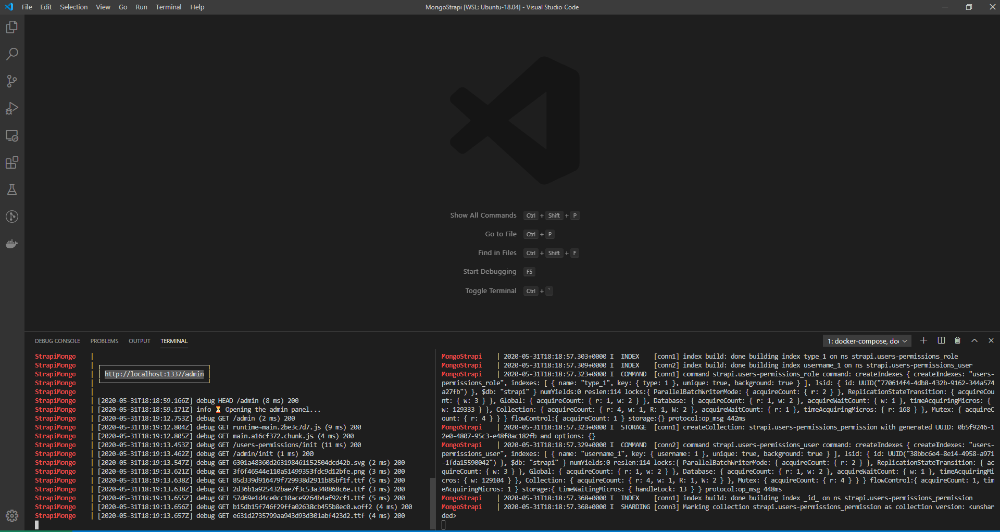

Format: 
# MongoStrapi

A very straightforward way to spin up a Strapi.io + MongoDB stack.

## Getting Started

To pull the necessary images

```$ docker-compose pull```

Then run the Stack!

```$ docker-compose up -d```

Watch things happening in Strapi container:

```$ docker-compose logs --tail=all -f | grep StrapiMongo ```

Watch things happening in Mongo container:

```$ docker-compose logs --tail=all -f | grep MongoStrapi ```

### Prerequisites

You'll need Docker and Docker-compose to work.

In a ubuntu environment you could run those commands in order to set docker engine up:

```
$ sudo apt-get remove docker docker-engine docker.io containerd runc

$ sudo apt-get update

$ sudo apt-get install \
    apt-transport-https \
    ca-certificates \
    curl \
    gnupg-agent \
    software-properties-common
    
$ curl -fsSL https://download.docker.com/linux/ubuntu/gpg | sudo apt-key add -

$ sudo add-apt-repository \
   "deb [arch=amd64] https://download.docker.com/linux/ubuntu \
   $(lsb_release -cs) \
   stable"

$ sudo apt-get update

$ sudo apt-get install docker-ce docker-ce-cli containerd.io

$ sudo usermod -aG docker your-user
```
Then you put docker-compose to run:

```
$ sudo curl -L "https://github.com/docker/compose/releases/download/1.25.5/docker-compose-$(uname -s)-$(uname -m)" -o /usr/local/bin/docker-compose

$ sudo chmod +x /usr/local/bin/docker-compose

$ sudo ln -s /usr/local/bin/docker-compose /usr/bin/docker-compose

```

To stop then:

```
$ docker-compose stop
```

To delete everything:

```
$ docker-compose down --rmi all -v
```

## Enter the Admin panel and start having fun!

```
http://localhost:1337/admin
```

## Authors

* **Frederico Dal Grande**

## Thanks to: 

* Victor Kane https://twitter.com/a_web_factory
